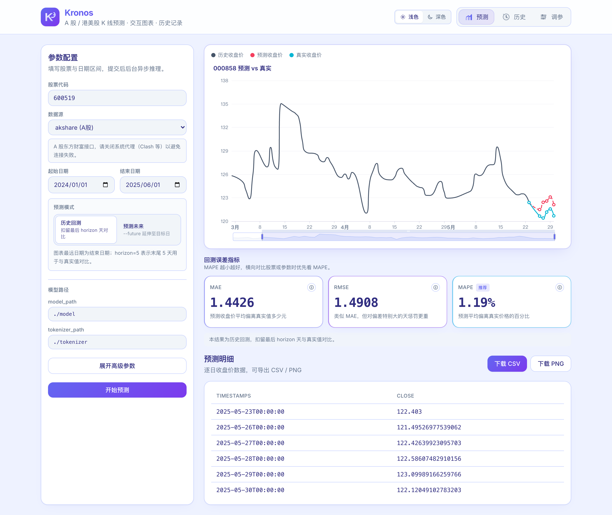
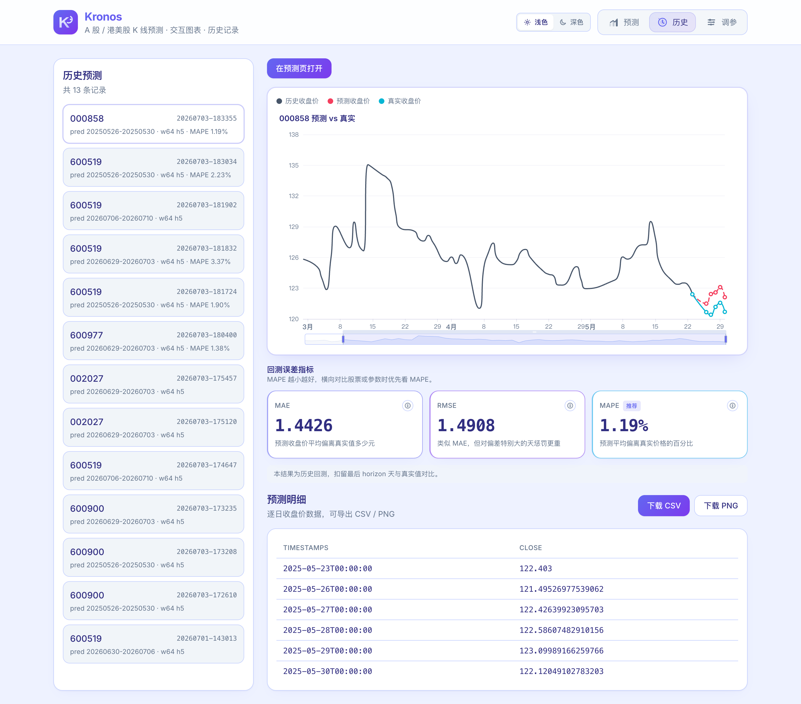
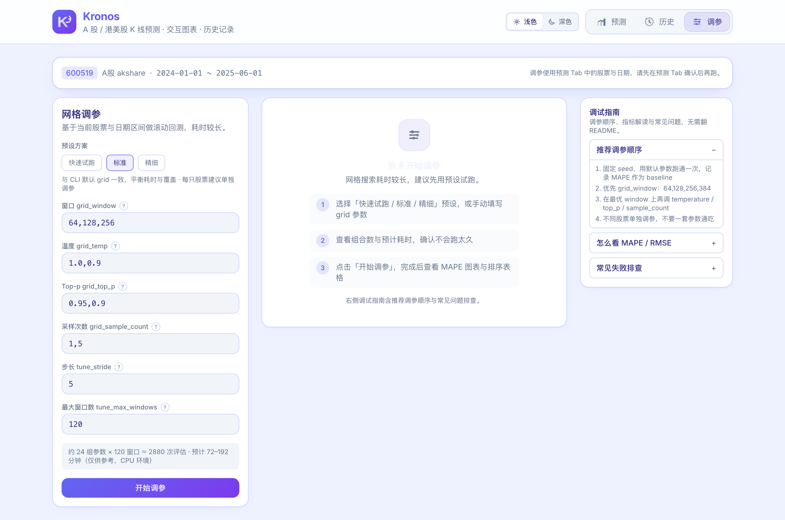
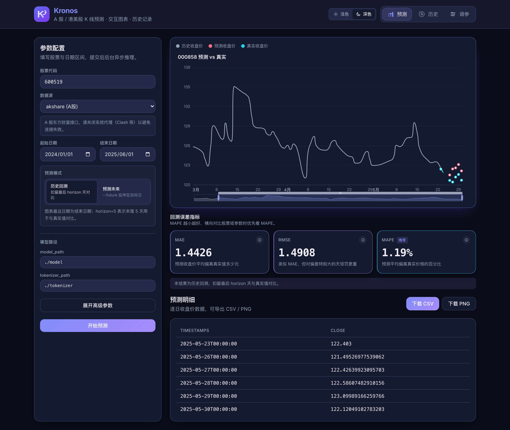

# Kronos 预测工作台

[](./LICENSE)

基于 [Kronos](https://github.com/shiyu-coder/Kronos) 金融时间序列模型的 A 股 / 港美股日线 K 线预测工具。

支持 **Web 可视化工作台** 与 **命令行（CLI）** 两套入口，共用同一套 `kronos_core` 预测逻辑：历史回测、未来预测、网格调参、交互式图表与误差指标解读。

<p align="center">
  
</p>

<p align="center">
  <em>预测 Tab：参数表单 · 交互式 K 线对比 · MAE / RMSE / MAPE 指标卡 · CSV / PNG 下载</em>
</p>

---

## 目录

- [界面预览](#界面预览)
- [功能一览](#功能一览)
- [快速开始（Web）](#快速开始web)
- [项目结构](#项目结构)
- [环境准备](#环境准备)
- [命令行用法](#命令行用法)
- [两种预测模式](#两种预测模式)
- [参数说明](#参数说明)
- [误差指标解读](#误差指标解读)
- [网格调参](#网格调参)
- [支持的市场](#支持的市场)
- [常见问题](#常见问题)
- [调参最佳实践](#调参最佳实践)
- [开源许可证](#开源许可证)

---

## 界面预览

Web 界面采用靛蓝–紫渐变品牌风格，内置 **浅色 / 深色** 主题切换（记忆用户选择）。

### 预测页（含结果）

配置股票、数据源、日期区间与预测模式，提交后异步推理，并展示历史 / 预测 / 真实三条曲线与回测误差。


### 历史页

浏览 `predictions/` 下的历史记录，点击可回放完整图表（含历史与真实对比线），并一键在预测页打开。



### 调参页

网格搜索最优参数组合：预设（快速 / 标准 / 精细）、参数说明、耗时预估、调试指南与 MAPE 结果可视化。



### 深色模式



| Tab | 能力 |
|-----|------|
| **预测** | 表单化参数、异步 Job、ECharts 交互图、MAE / RMSE / MAPE（含中文释义）、CSV / PNG 下载 |
| **历史** | 浏览历史预测、完整三线图回放、导出明细 |
| **调参** | 网格搜索、预设方案、参数 / 指标说明、组合数与耗时预估、最优参数一键回填 |

> CLI 与 Web 共用 `kronos_core/`，两边结果一致。

---

## 功能一览

- **历史回测**：扣留末尾 `horizon` 天，与真实收盘价对比，输出 MAE / RMSE / MAPE
- **未来预测**：`--future` 模式下，当「预测至日期」晚于最新 K 线时，自动延伸预测到该日所有交易日
- **多市场数据源**：A 股（akshare）、港股（hkshare）、美股（usstock / yfinance）、本地 qlib
- **交互图表**：历史 / 预测 / 真实曲线、区间缩放、未来预测 markLine
- **网格调参**：滚动窗口评估参数组合，输出排序表与最优参数
- **可复现**：固定 `--seed`，结果可复现
- **主题**：浅色 / 深色切换，偏好写入 `localStorage`

---

## 快速开始（Web）

### 生产模式（单端口）

```bash
cd ~/kronos_demo
source kronos_env/bin/activate
./scripts/start_web.sh
```

浏览器打开 [http://127.0.0.1:8000](http://127.0.0.1:8000)。前端静态资源由 FastAPI 托管，API 前缀为 `/api/*`。

### 开发模式（前端热重载）

```bash
cd ~/kronos_demo
source kronos_env/bin/activate
./scripts/dev_web.sh
```

| 服务 | 地址 |
|------|------|
| 前端 Vite | http://127.0.0.1:5173 （代理 `/api` → 后端） |
| 后端 API | http://127.0.0.1:8000 |

**首次使用建议流程：**

1. 在 **预测** Tab 填写股票代码、日期、模式，点击「开始预测」
2. 在 **历史** Tab 回看本次与历史结果
3. 需要调优时，在 **调参** Tab 选预设后跑网格搜索，再「应用到预测表单」

---

## 项目结构

```
kronos_demo/
├── kronos_qlib_predict.py    # CLI 入口
├── kronos_core/                # 共享预测 / 调参 / 图表 / 历史元数据逻辑
├── backend/                    # FastAPI 后端（异步 Job）
├── frontend/                   # React + Vite + Tailwind + ECharts
├── scripts/
│   ├── start_web.sh            # 构建前端 + 启动后端
│   └── dev_web.sh              # 开发模式
├── docs/screenshots/           # README 配图
├── tests/                      # 核心逻辑单测
├── openspec/                   # 规格与变更记录
├── model/                      # Kronos 模型权重（需自行下载）
├── tokenizer/                  # Tokenizer（需自行下载）
├── Kronos/                     # 官方源码（git clone）
├── qlib_data/                  # 可选本地 qlib 数据
├── predictions/                # 预测输出（自动创建）
└── kronos_env/                 # Python 虚拟环境
```

---

## 环境准备

```bash
cd ~/kronos_demo
source kronos_env/bin/activate
```

激活成功后，终端前缀会出现 `(kronos_env)`。

依赖要点：

- Python 依赖见 `Kronos/requirements.txt` 与 `backend/requirements.txt`
- 前端依赖：`cd frontend && npm install`
- 模型与 tokenizer 需放到 `./model`、`./tokenizer`（体积大，不纳入 Git）

---

## 命令行用法

### 第一次 CLI 预测（推荐 akshare）

> 拉取 A 股前请关闭 Clash 等**系统代理**（东方财富为国内接口，走代理容易失败）。

```bash
PYTHONPATH=./Kronos python kronos_qlib_predict.py \
  --data-source akshare \
  --instrument 600519 \
  --start 2024-01-01 \
  --end 2025-06-01 \
  --model-path ./model \
  --tokenizer-path ./tokenizer \
  --window 64 \
  --horizon 5 \
  --seed 40
```

本地 qlib（离线，数据通常截止较早）：

```bash
PYTHONPATH=./Kronos python kronos_qlib_predict.py \
  --data-source qlib \
  --provider-uri ./qlib_data \
  --instrument SH600519 \
  --start 2018-01-01 \
  --end 2020-09-25 \
  --model-path ./model \
  --tokenizer-path ./tokenizer \
  --window 64 \
  --horizon 5 \
  --seed 40
```

结果默认写入 `predictions/`，文件名包含股票代码、预测区间、参数与运行时间。

---

## 两种预测模式

### 1. 历史回测（默认）

自动扣留末尾 `horizon` 天作为「真实答案」，与预测对比。图中：

- **历史收盘价**（灰 / 蓝灰）
- **预测收盘价**（红虚线）
- **真实收盘价**（青 / 绿）

适合：检验历史区间准确性、做参数调优。

```bash
PYTHONPATH=./Kronos python kronos_qlib_predict.py \
  --data-source akshare \
  --instrument 600519 \
  --start 2024-01-01 \
  --end 2025-06-01 \
  --model-path ./model \
  --tokenizer-path ./tokenizer \
  --window 64 \
  --horizon 5 \
  --seed 40
```

### 2. 未来预测（`--future`）

使用全部可用历史 K 线预测尚未发生的区间（图上通常无真实对比线）。

**`--end` / Web「预测至日期」语义：**

| 条件 | 行为 |
|------|------|
| `end` **晚于** 最新 K 线 | 预测从次一交易日延伸至 `end` 之间全部交易日 |
| `end` **不晚于** 最新 K 线 | 仍按 `horizon` 预测固定天数 |

行情数据本身仍只拉到最新交易日；延伸部分由模型生成未来时间戳。

```bash
PYTHONPATH=./Kronos python kronos_qlib_predict.py \
  --data-source akshare \
  --instrument 600519 \
  --start 2024-01-01 \
  --end 2026-07-10 \
  --model-path ./model \
  --tokenizer-path ./tokenizer \
  --window 64 \
  --horizon 5 \
  --seed 40 \
  --future
```

Web：**预测模式** 选「预测未来」，将「预测至日期」设为希望覆盖的最后一天。

---

## 参数说明

### 基础

| 参数 | 默认 | 说明 |
|------|------|------|
| `--data-source` | `qlib` | `qlib` / `akshare` / `hkshare` / `usstock` |
| `--provider-uri` | — | qlib 本地数据路径 |
| `--instrument` | 必填 | 股票代码（见下方市场说明） |
| `--start` / `--end` | 必填 | 历史区间；未来模式且 end 晚于最新 K 线时，end 亦为预测终点 |
| `--future` | 关 | 未来预测 |
| `--adjust` | `qfq` | akshare 复权：`qfq` / `hfq` / 空 |

### 模型

| 参数 | 默认 | 说明 |
|------|------|------|
| `--model-path` | 必填 | 模型目录 |
| `--tokenizer-path` | 必填 | tokenizer 目录 |
| `--device` | `cpu` | `cpu` / `cuda` / `mps` |
| `--max-context` | `512` | 最大上下文，一般不改 |

### 预测（影响效果）

| 参数 | 默认 | 说明 | 调优建议 |
|------|------|------|----------|
| `--window` | `64` | 输入历史天数 | 优先尝试 `64/128/256/384` |
| `--horizon` | `5` | 回测扣留天数；未来模式且 end ≤ 最新 K 线时的预测天数 | 先从 5 开始 |
| `--seed` | `40` | 随机种子 | 对比实验时保持不变 |
| `--temperature` | `1.0` | 采样温度 | `1.0 / 0.9 / 0.7` |
| `--top-p` | `0.9` | nucleus sampling | `0.95 / 0.9 / 0.8` |
| `--sample-count` | `1` | 采样次数，取均值更稳 | `1 / 5 / 10`（越大越慢） |

Web **高级参数** 与 **调参 Tab** 内置中文说明与调试提示，可直接点问号查看。

---

## 误差指标解读

历史回测会输出例如：

```text
MAE=1.4426, RMSE=1.4908, MAPE=1.19%
```

| 指标 | 含义 | 怎么看 |
|------|------|--------|
| **MAE** | 平均绝对误差（价格量纲） | 受股价高低影响，跨股票横向对比有限 |
| **RMSE** | 均方根误差 | 对大偏差更敏感；通常 ≥ MAE |
| **MAPE** | 平均绝对百分比误差 | **优先看**，横向对比最公平 |

> MAPE 越小越好。Web 指标卡可展开详细释义；调参表头亦可查看说明。

---

## 网格调参

系统搜索历史上表现更好的参数组合（耗时：组合数 × 滚动窗口数）。

**Web：** 直接用调参 Tab（推荐「快速试跑」先验证通路）。

**CLI：**

```bash
PYTHONPATH=./Kronos python kronos_qlib_predict.py \
  --data-source akshare \
  --instrument 600519 \
  --start 2023-01-01 \
  --end 2025-06-01 \
  --model-path ./model \
  --tokenizer-path ./tokenizer \
  --horizon 5 \
  --seed 40 \
  --tune \
  --grid-window 64,128,256 \
  --grid-temp 1.0,0.9 \
  --grid-top-p 0.95,0.9 \
  --grid-sample-count 1,5 \
  --tune-stride 5 \
  --tune-max-windows 120
```

| 参数 | 默认 | 说明 |
|------|------|------|
| `--tune` | 关 | 开启调参 |
| `--grid-window` | `64,128,256` | window 候选 |
| `--grid-temp` | `1.0,0.9` | 温度候选 |
| `--grid-top-p` | `0.95,0.9` | top_p 候选 |
| `--grid-sample-count` | `1,5` | 采样次数候选 |
| `--tune-stride` | `5` | 滚动步长（越小越准越慢） |
| `--tune-max-windows` | `120` | 每组参数最多评估窗口数 |

跑完后把最优 `window / temperature / top_p / sample_count` 填回普通预测命令；Web 可一键「应用到预测表单」。

---

## 支持的市场

### A 股（`akshare`）

`--instrument`：6 位数字（如 `600519`、`000858`）。关闭系统代理。

### 港股（`hkshare`）

`--instrument`：5 位数字（如 `00700` 腾讯）。走东方财富，同样建议直连。

### 美股（`usstock`）

`--instrument`：ticker（如 `AAPL`）。依赖 `yfinance`，需能访问境外网络。

```bash
pip install yfinance
```

### 本地 qlib

`--instrument` 需带交易所前缀，如 `SH600519`。数据覆盖范围以本地为准。

---

## 常见问题

**1. akshare / hkshare：ProxyError / RemoteDisconnected**

关闭系统代理，或让 `eastmoney.com` 走 DIRECT。

**2. usstock 超时**

需要 VPN，先在浏览器验证 [Yahoo Finance](https://finance.yahoo.com)。

**3. `ModuleNotFoundError: einops` 等**

```bash
pip install -r Kronos/requirements.txt
pip install -r backend/requirements.txt
```

**4. `No module named 'model'`**

命令前加 `PYTHONPATH=./Kronos`（CLI）；Web 脚本已自动设置。

**5. 没有取到数据**

检查代码格式（akshare 不带 SH/SZ；qlib 要带）、网络与日期是否在数据范围内。

**6. 预测很慢**

CPU 推理偏慢；`window=64, sample_count=1` 最快。调参会乘上千上万次评估，宜用快速预设先试。

**7. 历史页只有预测红线**

旧记录缺少 `*_meta.json`。重新跑一次预测即可保存完整历史 + 真实曲线。

**8. 未来模式红线到不了所选日期**

确认已勾选「预测未来 / `--future`」，且结束日晚于最新交易日；否则只会按 `horizon` 延伸。

---

## 调参最佳实践

1. 固定 `--seed`，建立 baseline MAPE
2. 优先网格搜索 `--window`
3. 在最优 window 上调 `temperature / top_p / sample_count`
4. **每只股票单独调参**，不要一套参数通吃
5. 跨标的比较一律看 **MAPE**

---

## 开源许可证

本项目基于 [Apache License 2.0](./LICENSE) 开源。Kronos 模型、行情数据源及其他第三方依赖仍适用各自的许可证和使用条款。

---

*文档更新：2026-07*
